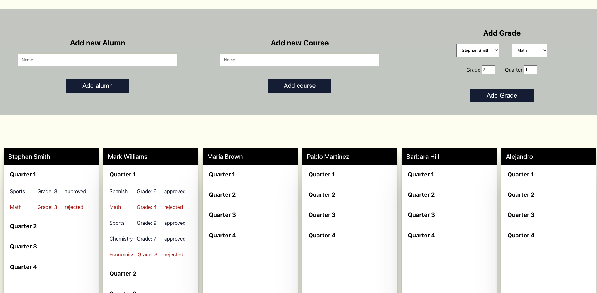

# Alumns Front

> Front-end app where teachers can manage grades on alumns.

## Built With

- React "^18.2.0"
- React Router Dom "^6.3.0"
- Axios "^0.27.2"

## Getting Started

- Git clone the [API](https://github.com/AlejandroNo4/alumns-API) and run **"bundle install -> rails db:seed"**

- Important 🚦❗❗❗ This project will need to be run locally at the same time as the API, to run the API, run:

      rails s -p 3001

- Clone this repo and run react as usual (**"npm install -> npm start"**)

- The route "/" will ask you to sign up or log in. You may use a pre-made account with the credentials:

      email: 'test@mail.com', password: 'password'

- When logged in, "dashboard" will show each alumn that has been created (with rails db:seed) and each with four quarters, but no "grades" yet.

- To create a "grade", fill out the form and submit it, this automatically will add the grade to the respective user.

- When sending a bad request, a banner will appear at the top of the form.

- The teacher can add "Alumns" and "Courses" as well.

- The User can create an account, log in or log out.
